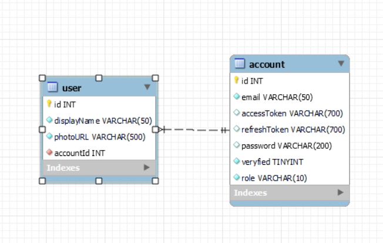

# TRIỂN KHAI AUTH SERVER

## DATABASE CƠ BẢN:

- Mình sẽ triển khai trên 2 table này .Với mysql mình mới tiếp cận nên việc để relation 1 : 1 chưa chuẩn. Cho nên trên prisma, mình đã config lại relation của 2 table này thành 1 : 1.
<pre>
 
model account {
  id           Int     @id @default(autoincrement())
  email        String  @unique(map: "email_UNIQUE") @db.VarChar(50)
  accessToken  String? @db.VarChar(700)
  refreshToken String? @db.VarChar(700)
  password     String? @db.VarChar(200)
  veryfied     Int     @default(0) @db.TinyInt
  role         String  @default("user") @db.VarChar(10)
  user         user?   
}

model user {
  id          Int     @id @default(autoincrement())
  displayName String  @db.VarChar(50)
  photoURL    String  @db.VarChar(500)
  account     account? @relation(fields: [accountId], references: [id])
  accountId   Int     @unique(map: "idAccount_UNIQUE") 
}
 
</pre>

- Với sự giúp đỡ của prisma thì mình sẽ sử dụng 1 số câu lệnh để tạ các table tự động.[xem trong file package.json]
<pre>
    Run:
    B1: npx prisma db pull
    B2: npx prisma generate

</pre>
- Và các câu lệnh migrate các table được tạo ở file <b>schema.prisma</b> về database 1 cách tự động.
<pre>
    Run:
    B1: yarn prisma migrate dev --name create_database && yarn prisma db push
    B2: yarn prisma migrate deploy      
</pre> 

## CÁC BƯỚC TRIỂN KHAI 
# CÁC THƯ VIỆN HỖ TRỢ CƠ BẢN CHO HỆ THỐNG.

<pre>
    const express = require("express");
    const app = express();

    const morgan = require("morgan");
    const helmet = require("helmet");
    const cors = require("cors");
    const compression = require("compression");

    
    app.use(morgan("combined"));
    app.use(helmet());
    app.use(compression());
    app.use(cors());
    require("dotenv").config();
    
    app.use(express.json());  
    app.use(express.urlencoded({ extended: true }));    
    const PORT = process.env.PORT;
    app.listen(PORT, () => {
      console.log(`Server is running on port http://localhost:${PORT}`);
    });  
</pre> 

- Với các thư viện trên sẽ hộ trợ trong việc bảo mật hệ thống và giảm tải trong quá trình gửi nhận dữ liệu.
- Mình recomment sử dụng thêm 1 thư viện có ở trên <b>compression</b> , nó hỗ nén dữ liệu khi gửi có thể nhẹ hơn gấp 10 lần.

## BỘ ROUTER
<pre>
    app.use('/api/v1',require('./src/routers')) 
</pre>

<pre>
    const express = require("express");
    const routes = express.Router();

    routes.use(require('../api/login/router'))
    routes.use(require('../api/register/router'))
    routes.use(require('../api/user/router'))
    routes.use(require('../api/imgage/router'))

    module.exports = routes;

</pre>

- Mô hình mình viết cơ bản sẽ gôp chung router, controller và server vào trong 1 forder. Điều này giúp mình quản lý dự án tốt hơn so với triển khai để các phần router, controller và server vào các forder chung.
## DESIGN FACTORY RESPONSE
- Ở đây mình sẽ thiết kế các class phản hồi chính xác và lỗi. Để tối ưu thì mình dùng <b>factory design</b> để được tối ưu nhất có thể. Xem file <b>response_design</b>.
<pre>
  class RESPONSE {
    constructor(statusCode, message, data) {
      this.statusCode = statusCode;
      this.message = message;
      this.data = data;
      if (this.constructor === RESPONSE) {
        throw new Error("Cannot instantiate abstract class ERROR");
      }
    }
  }
  
  class Response200 extends RESPONSE {
    constructor(data) {
      super(200, "OK", data);
    }
  }
  ....
  ....

  class ResponseFactory {
    static createResponse(statusCode, data) {
      switch (statusCode) {
        case 200:
          return new Response200(data);
        case 201:
          return new Response201(data);
        case 204:
          return new Response204(); // Không cần truyền data
        case 400:
          return new ERROR400(data);
        case 401:
          return new ERROR401(data);
        case 403:
          return new ERROR403(data);
        case 404:
          return new ERROR404(data);
        case 500:
          return new ERROR500(data);
        case 503:
          return new ERROR503(data);
        default:
          throw new Error("Invalid status code");
      }
    }
  }
  
</pre>

- Kết quả trả về gồm 3 tham số :status code , message và data, cho biết trang thái của api và dữ liệu trả về có thành công hay không.
  

## API REGISTER
<pre>
    const express = require('express')
    const controller = require('./controller')
    const  routersRegister =express.Router()
    routersRegister.post('/register',controller.register)
    routersRegister.get('/verified',controller.verified)
    module.exports = routersRegister
</pre>
- Khi đăng kí tài khoản với email và password. Mình sẽ thực thi các task vụ chính.
  - Kiểm tra email có tồn tại.
  - Nếu email chưa đăng kí thì cho phép tạo.
  - Mã hóa password với jwt, bcrypt. Mình dùng key secret ở đây là private.key và giải mã là public.pem .
  - Thuật toán sử dụng là RS256.
  - 
  - Send Mail tới người dùng để xác nhận email. Ở đây mình đặt verified trong database là 0 và nếu xác nhận thành công thì sẽ thành 1. [Xem file gmail.]
  - Tiếp theo mình sẽ gửi đi 1 thông điệp với rabbitMQ, kèm theo là id của user mình mới tạo để tạo dữ liệu mới cho database wallet với balance là 0 đồng.[Xem file rabitMQ]
<pre>
    
async function producer(message) {
  try {
    // Kết nối tới RabbitMQ server
    const connection = await amqp.connect(url);

    // Tạo kênh kết nối
    const channel = await connection.createChannel();

    // Khai báo một hàng đợi
    const queueName = "CreateNewWallet";
    await channel.assertQueue(queueName, { durable: false }); // set lai thanh true khi use docker

    channel.sendToQueue(
      queueName,
      Buffer.from(JSON.stringify(message), "utf8"),
      {
        expiration: "1000",
        persistent: true,
      }
    );

    // // Đóng kết nối
    // setTimeout(() => {
    //     connection.close();
    //     process.exit(0);
    // }, 1000);
  } catch (error) {
    console.error("Error:", error);
  }
}
</pre>

## LOGIN EMAIL && PASSWORD , LOGIN GOOGLE 

### Router
<pre>
    routersLogin.post('/login',controller.loginController)
    routersLogin.post('/refreshToken',controller.refreshTokenController)
    routersLogin.post('/loginGoogle',controller.loginGoogleController)
</pre>

### Login email password: 
  - Kiểm tra email.
  - Kiểm tra verified.
  - Kiểm tra password bằng cách so sánh password khi mã hóa với bcrypt có giống với password đã mã hóa trước khi đăng kí. Với thuật toán mã hóa 1 chiều, thì độ bảo mật khá cao.
<pre>
    // Hàm mã hóa JWT sử dụng private key
    const encodeToken = (payload) => {
    // Đường dẫn tuyệt đối đến private key
    const privateKeyPath = path.join(__dirname, "key", "private.key");

    // Đọc private key từ file
    const privateKey = fs.readFileSync(privateKeyPath);

    // Mã hóa JWT bằng RSA private key
    const encodedJWT = jwt.sign(payload, privateKey, {
      algorithm: "RS256",
      expiresIn: "1d",
    });
    return encodedJWT;
  };
  </pre>
  - Trả về accesstoken và refreshtoken.[Xem file encode].